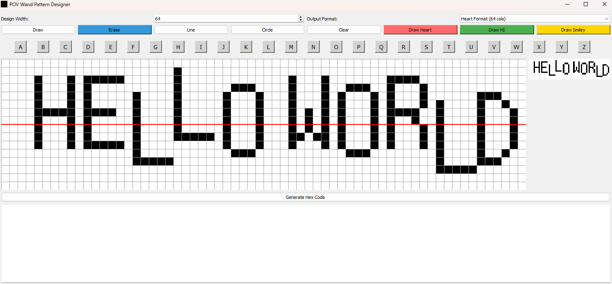
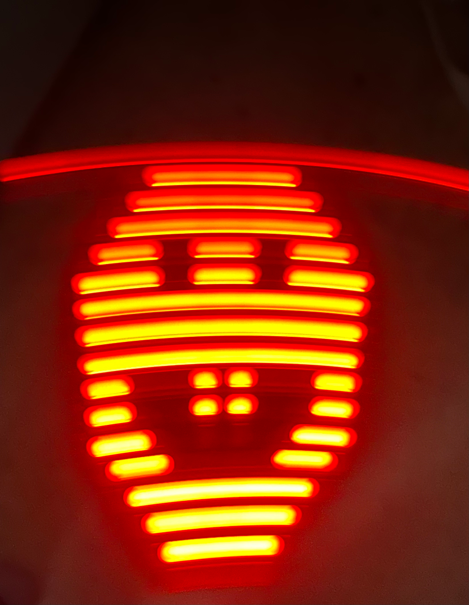

# POV Wand Pattern Designer

A graphical tool for creating persistence of vision (POV) LED patterns for programmable wands and similar devices.

## Overview

This application allows you to design patterns that can be displayed on POV (Persistence of Vision) LED wands. These are devices with a row of LEDs that, when waved through the air, create the illusion of an image due to the persistence of vision effect.




[POV Wand Example](https://www.aliexpress.us/item/3256806595449574.html)

## Features

- Design grid with customizable width
- Multiple drawing tools: brush, eraser, line, and circle
- Predefined patterns: Heart, HI, Smiley
- Real-time preview of the pattern
- Support for two output formats: Heart (64 columns) and Hanzi (16 columns)
- Generates hex code ready to use in Arduino or other microcontroller programs

## Installation

1. Clone this repository:
   ```
   git clone https://github.com/yourusername/pov-wand-generator.git
   cd pov-wand-generator
   ```

2. Create and activate a virtual environment (optional but recommended):
   ```
   python -m venv venv
   # On Windows
   venv\Scripts\activate
   # On macOS/Linux
   source venv/bin/activate
   ```

3. Install the required dependencies:
   ```
   pip install -r requirements.txt
   ```

## Usage

1. Run the application:
   ```
   python POV_Pattern.py
   ```

2. Design your pattern using the available tools:
   - Use the drawing tools (Draw, Erase, Line, Circle) to create your pattern
   - Try the predefined patterns (Heart, HI, Smiley)
   - Adjust the design width as needed

3. Generate the hex code by clicking the "Generate Hex Code" button

4. Copy the generated code and use it in your microcontroller program

## Output Format

The application supports two output formats:

- **Heart Format**: 64 columns wide, suitable for larger POV displays
- **Hanzi Format**: 16 columns wide, optimized for smaller displays or specific hardware configurations

The generated hex code represents the LED pattern in a format that can be directly used in Arduino or other microcontroller code.

## Example Output

```
0x00,0x00,0x00,0x00,0x00,0x00,0x00,0x00,0x00,0x00,0x00,0x00,0x00,0x00,0x00,0x00,
0x00,0x00,0x00,0x00,0x00,0x00,0x00,0x00,0x00,0x00,0x00,0x00,0x00,0x00,0x00,0x00,
0x00,0x00,0x00,0x00,0x00,0x00,0x00,0x00,0x00,0x00,0x00,0x00,0x00,0x00,0x00,0x00,
0x00,0x00,0x00,0x00,0x00,0x00,0x00,0x00,0x00,0x00,0x00,0x00,0x00,0x00,0x00,0x00,
0x00,0x00,0x00,0x00,0x00,0x00,0x00,0x00,0x00,0x00,0x00,0x00,0x00,0x00,0x00,0x00,
0x00,0x00,0x00,0x00,0x00,0x00,0x00,0x00,0x00,0x00,0x00,0x00,0x00,0x00,0x00,0x00,
0x00,0x00,0x00,0x00,0x00,0x00,0x00,0x00,0x00,0x00,0x00,0x00,0x00,0x00,0x00,0x00,
0x00,0x00,0x00,0x00,0x00,0x00,0x00,0x00,0x00,0x00,0x00,0x00,0x00,0x00,0x00,0x00,
```

## License

MIT License

## Contributing

Contributions are welcome! Please feel free to submit a Pull Request.
